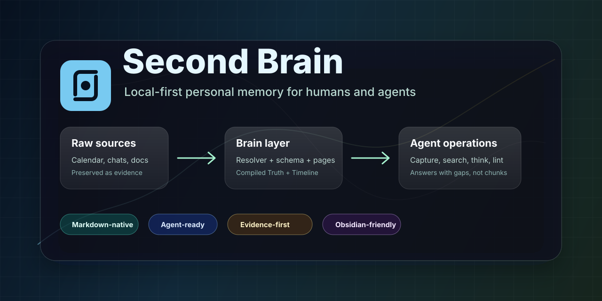

<p align="center">
  
</p>

<p align="center">
  <a href="SKILL.md"></a>
  <a href="AGENTS.md"></a>
  <a href="llms.txt"></a>
  
</p>

<p align="center">
  <a href="README.zh-CN.md">中文版 README</a>
</p>

# Second Brain

**Second Brain is a local-first personal memory layer for humans and agents.**

It turns chats, Feishu docs, calendar events, diary drafts, links, and notes into a Markdown-native brain that agents can search, synthesize, lint, and maintain over time.

The goal is not another knowledge base. The goal is a durable context layer that remembers what happened, what it means, what is still open, and what the agent should ask next.

## Why It Exists

Most personal knowledge systems stop at storage or retrieval:

- note apps store pages
- RAG systems retrieve chunks
- generic assistants answer from the current chat

Second Brain adds the missing maintenance layer:

- raw sources stay preserved as evidence
- entities get canonical pages
- current understanding is separated from evidence history
- agents search first, then synthesize
- lint turns missing context into useful follow-up questions

## How It Is Different

| Dimension | Pure Knowledge Base | RAG over notes | Second Brain |
|-|-|-|-|
| Primary job | Store information | Retrieve chunks | Maintain personal context |
| Human-readable middle layer | Yes | Usually no | Yes, Markdown pages |
| Agent-readable structure | Weak | Retrieval-only | Resolver, schema, skills, evals |
| Evidence model | Informal | Chunk provenance | Raw sources + Timeline |
| Current understanding | Mixed into notes | Recomputed per query | Compiled Truth |
| Proactive maintenance | Manual | Rare | `wiki_lint` + open questions |
| Best use | Archiving | Search | Remembering yourself over time |

## Core Idea

Each canonical entity page has two layers:

```text
Compiled Truth       current synthesis, rewritten as understanding improves
---
Timeline             append-only evidence with dates and sources
```

This lets the brain answer two different questions cleanly:

- "What do we currently think about this person/project/concept?"
- "What happened, when, and where did that claim come from?"

## Quick Start: Skill-style Entry

```bash
git clone https://github.com/chengjialu8888/Second_brain.git
cd Second_brain

# See the skill-style command surface
scripts/second_brain.sh help
```

Use it like an agent skill from the terminal:

```bash
# Search local memory
scripts/second_brain.sh search "llm-wiki"

# Lint the brain structure
scripts/second_brain.sh lint

# Generate a diary draft from Feishu calendar
scripts/second_brain.sh diary 2026-06-12

# Show the agent startup prompt
scripts/second_brain.sh prompt
```

For the calendar diary workflow, authorize the minimal Feishu scope first:

```bash
lark-cli auth login --scope "calendar:calendar.event:read"
```

Then run:

```bash
scripts/second_brain.sh diary today
```

The generated diary remains `status: draft` until you add subjective context. Calendar knows what happened; only you know what it meant.

### Agent Prompt Entry

If you are using Codex, Claude Code, Cursor, or another coding agent, start with:

```text
Use this repository as the $second-brain skill.
Read AGENTS.md, SKILL.md, brain/RESOLVER.md, brain/schema.md, and skills/RESOLVER.md.
Then help me capture, ingest, search, think, lint, or generate diary drafts without committing private source data.
```

## User Journey

<p align="center">
  
</p>

## Core Architecture

<p align="center">
  
</p>

## Repository Map

```text
.
├── SKILL.md                     # Agent-facing workflow entrypoint
├── AGENTS.md                    # Operating rules for Codex, Claude Code, Cursor, etc.
├── llms.txt                     # Compact map for LLM crawlers and agent fetchers
├── brain/
│   ├── RESOLVER.md              # Filing and ownership rules
│   ├── schema.md                # Page templates and evidence discipline
│   ├── index.md                 # Default human/agent entrypoint
│   ├── people/ concepts/ projects/ diary/
│   └── sources/                 # Immutable source snapshots
├── skills/                      # Workflow docs: ingest, query, enrich, lint, diary
├── scripts/                     # Deterministic local utilities
├── evals/                       # Seed eval cases for routing, filing, query, lint
└── docs/                        # Human and agent-facing docs
```

## What Works Today

- Local Markdown brain skeleton
- Skill-style CLI wrapper: `scripts/second_brain.sh`
- Resolver and schema discipline
- Seed concept/project pages
- Feishu calendar to diary draft
- Feishu doc snapshot helper
- Link extraction
- Local search
- Structural lint
- Seed eval cases
- Agent crawler map via `llms.txt`

## What Is Next

- Better chat and Feishu doc ingestion
- Entity alias and duplicate detection
- Richer `think` synthesis over search results
- Weekly lint report
- Optional SQLite FTS5 index
- Optional Obsidian vault polish
- Optional MCP layer for remote agents

## For Humans

Open `brain/` as an Obsidian vault if you want backlinks, graph view, and manual review.

Recommended first places:

- `brain/index.md`
- `brain/RESOLVER.md`
- `brain/schema.md`
- `brain/projects/second-brain.md`

## For Agents

Start here:

1. `llms.txt`
2. `AGENTS.md`
3. `SKILL.md`
4. `brain/RESOLVER.md`
5. `brain/schema.md`
6. `skills/RESOLVER.md`

Rule of thumb: **search first, then think; preserve evidence, then synthesize.**

## Contributing

This is an early MVP. Useful contributions include:

- better source ingestion workflows
- stricter lint checks
- safer diary and calendar handling
- Obsidian-friendly templates
- agent eval cases
- docs and examples

See [CONTRIBUTING.md](CONTRIBUTING.md).

## Project Status

MVP. The current version is intentionally local-first and small. It is designed to validate the memory workflow before adding heavier infrastructure like vector search, graph storage, background jobs, or MCP.
