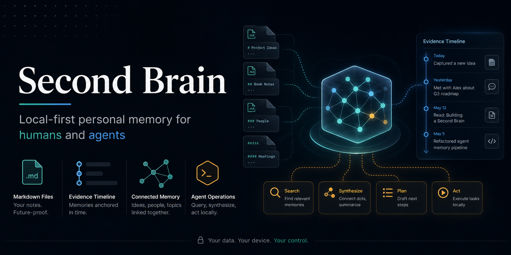
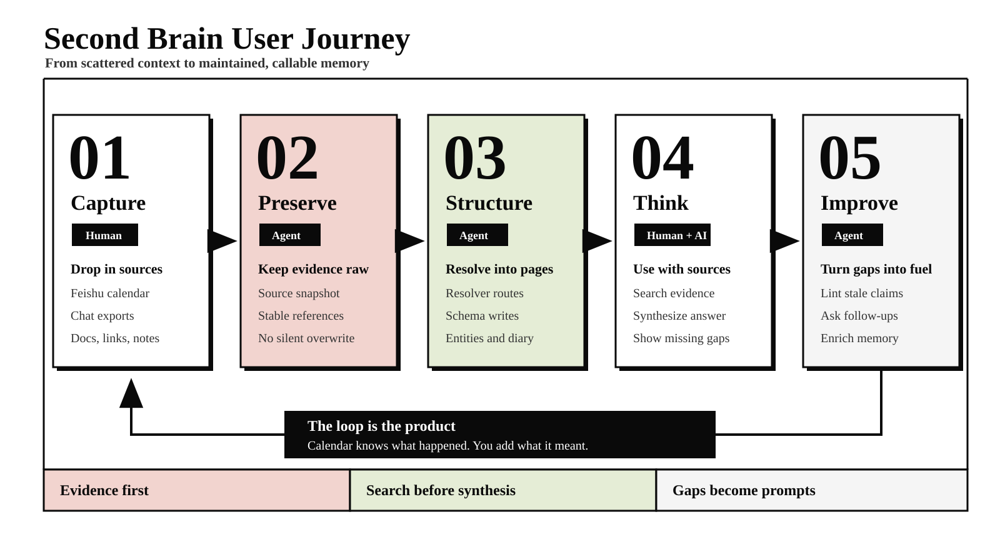
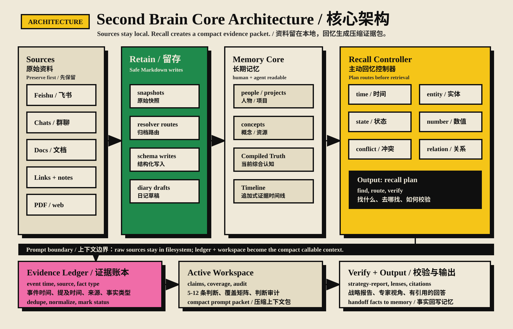

<p align="center">
  
</p>

<p align="center">
  <a href="SKILL.md"></a>
  <a href="AGENTS.md"></a>
  <a href="llms.txt"></a>
  
</p>

<p align="center">
  <a href="README.md">English README</a>
</p>

# Second Brain

**Second Brain 是一个面向人类和 Agent 的本地优先个人记忆层。**

它把群聊、飞书文档、日历日程、日记草稿、链接和普通笔记，沉淀成一个 Markdown-native 的个人大脑。Agent 可以围绕它完成记忆编译、记忆管理、search、think、lint 和日记草稿生成。

它的目标不是再做一个知识库，而是做一个可长期维护的上下文层：记住发生了什么、这件事意味着什么、还有什么没搞清楚，以及 Agent 下一步应该问什么。

## 为什么需要它

大多数个人知识系统停在“存储”或“检索”：

- 笔记软件负责存页面
- RAG 系统负责召回 chunk
- 通用助手只理解当前对话

Second Brain 补上的是“维护层”：

- 原始资料作为证据保留
- 人物、项目、概念有 canonical 页面
- 当前认知和证据时间线分开
- Agent 先 search，再 think
- lint 把缺失上下文变成可回答的问题
- 专家输出层把同一份记忆转成产品、工程、设计、增长、销售、安全、测试等岗位视角的交付物

## 和纯知识库有什么不同

| 维度 | 纯知识库 | Obsidian | 笔记上的 RAG | Second Brain |
|-|-|-|-|-|
| 核心任务 | 存信息 | 人类 PKM、双链、图谱思考 | 召回片段 | 维护个人上下文 |
| 输入处理 | 保存笔记 | 快速手动记录和链接 | 文档切 chunk | 从群聊、文档、日历、日记、链接中编译并管理记忆 |
| 查找方法 | 手动浏览 | 本地搜索、backlinks、graph、插件 | 相似度召回 | Resolver、schema、实体页、source refs 组成结构化检索 |
| 输出形态 | 普通笔记 | 人类自己写的笔记和 canvas | 通用回答 | 通过专家 Agent 层生成不同岗位风格的交付物 |
| 人类可读中间层 | 有 | 很强，Markdown vault 和 UI 都成熟 | 通常没有 | 有，Markdown 页面 |
| Agent 可读结构 | 弱 | 文件可读，但规则通常靠人约定 | 只偏检索 | Resolver、schema、skills、evals |
| 证据模型 | 松散 | 双链和手动引用 | chunk provenance | raw sources + Timeline |
| 当前认知 | 混在笔记里 | 主要靠人手动维护 | 每次查询重算 | Compiled Truth |
| 主动维护 | 手动 | 手动 review 或插件辅助 | 很少 | `wiki_lint` + open questions |
| 最适合 | 归档 | 人类 sense-making 和个人笔记探索 | 搜索 | 在 Agent 帮助下长期记住“你” |

Obsidian 依然很适合作为 vault 的浏览和编辑界面。Second Brain 更像是叠在 Markdown vault 之上的 Agent 操作层，让同一份记忆可治理、可结构化查找、可维护，并且可以按岗位输出。

## 核心亮点

Second Brain 覆盖完整的上下文生命周期：

1. **输入：记忆编译和管理**
   群聊、飞书文档、日历日程、日记草稿、链接和笔记会先作为原始证据保留，再被编译进人物、项目、概念、日记、资源等 canonical 页面。

2. **查找：先结构化检索，再综合**
   Agent 不只做关键词或向量召回，而是结合本地搜索、resolver 规则、schema、source refs、Compiled Truth 和 Timeline 找到可追溯上下文。

3. **输出：按岗位设定生成交付物**
   当回答需要专业表达时，Agency Agents 层会提供合适的专家视角：Product Manager 写 PRD，Feishu Integration Developer 设计飞书工作流，UX Researcher 做用户洞察，Security Architect 做风险评审，Test Planner 做 QA 计划，等等。

## 核心设计

每个 canonical 实体页分两层：

```text
Compiled Truth       当前综合认知，可随理解更新
---
Timeline             追加式证据时间线，带日期和来源
```

这样可以干净地区分两个问题：

- “我们现在怎么看这个人/项目/概念？”
- “这个判断来自哪一天、哪条证据？”

## 快速开始：像 Skill 一样使用

```bash
git clone https://github.com/chengjialu8888/Second_brain.git
cd Second_brain

# 查看 skill-style 命令入口
scripts/second_brain.sh help
```

常用命令：

```bash
# 搜索本地记忆
scripts/second_brain.sh search "llm-wiki"

# 检查 brain 结构
scripts/second_brain.sh lint

# 从飞书日历生成日记草稿
scripts/second_brain.sh diary 2026-06-12

# 输出 Agent 启动提示词
scripts/second_brain.sh prompt
```

如果要使用飞书日历生成日记草稿，先授权最小 scope：

```bash
lark-cli auth login --scope "calendar:calendar.event:read"
```

然后运行：

```bash
scripts/second_brain.sh diary today
```

生成的日记会保持 `status: draft`，直到你补充主观感受。日历知道“发生了什么”，但只有你知道“这意味着什么”。

### Agent 入口提示词

如果你在 Codex、Claude Code、Cursor 或其他 coding agent 里使用，可以直接说：

```text
Use this repository as the $second-brain skill.
Read AGENTS.md, SKILL.md, brain/RESOLVER.md, brain/schema.md, and skills/RESOLVER.md.
When output needs a specialist lens, also read skills/agency-agent-routing.md and use agents/agency-agents/ after searching Second Brain evidence.
Then help me capture, ingest, search, think, lint, route specialist agents, or generate diary drafts without committing private source data.
```

## 用户旅程

<p align="center">
  
</p>

## 核心架构

<p align="center">
  
</p>

这套架构也可以理解成一张“运行解剖图”：`brain/` 是身体，`brain/sources/` 是证据层，Compiled Truth 和 Timeline 组成记忆模型，`skills/` 是可重复工作流，`wiki_lint` 是免疫系统。每个部分都应该说明它的 filter 和 fissure：它如何过滤世界，以及它无法弥合什么。详见 [docs/ARCHITECTURE.md](docs/ARCHITECTURE.md)。

## 专家 Agent 层

Second Brain 现在内置一个可选的 [Agency Agents](agents/agency-agents/README.md) 专家层：来自 [msitarzewski/agency-agents](https://github.com/msitarzewski/agency-agents/tree/main) 的 233 个专家 prompt，已作为本地 source 文件和可搜索 roster 安装进仓库。

规则很简单：**先 memory，后专家视角**。当输出需要产品规划、架构评审、设计 critique、增长策略、安全 review、测试计划等专业判断时，Agent 应先 search/read Second Brain 证据，再选择合适专家：

```bash
scripts/second_brain.sh agents "product strategy"
scripts/second_brain.sh agents "Feishu integration"
scripts/second_brain.sh agents "security review"
```

调用协议见 [skills/agency-agent-routing.md](skills/agency-agent-routing.md)。

## 仓库结构

```text
.
├── SKILL.md                     # Agent-facing workflow entrypoint
├── AGENTS.md                    # Codex / Claude Code / Cursor 等 Agent 的操作规则
├── llms.txt                     # 给 LLM crawler 和 agent fetcher 的紧凑索引
├── brain/
│   ├── RESOLVER.md              # 归档和 ownership 规则
│   ├── schema.md                # 页面模板和证据规范
│   ├── index.md                 # 人类和 Agent 的默认入口
│   ├── dashboards/              # Obsidian-friendly 的人类审阅驾驶舱
│   ├── templates/               # Obsidian-ready 页面模板
│   ├── people/ concepts/ projects/ diary/
│   └── sources/                 # 原始资料快照
├── skills/                      # ingest、query、enrich、lint、diary 等工作流
├── agents/agency-agents/        # 可选专家 Agent 层和 roster
├── scripts/                     # 可执行的小工具
├── evals/                       # routing / filing / query / lint 种子评测
└── docs/                        # 面向人类和 Agent 的文档
```

## 当前可用

- 本地 Markdown brain 骨架
- Skill-style CLI 入口：`scripts/second_brain.sh`
- Resolver 和 schema 规范
- 种子概念页和项目页
- 飞书日历生成日记草稿
- 飞书文档快照脚本
- 链接抽取
- 本地搜索
- 结构 lint
- 种子 eval case
- Agency Agents 专家路由
- Obsidian-ready dashboards、模板、graph 配色和 CSS snippet
- `llms.txt` Agent 抓取入口

## 下一步

- 更好的群聊和飞书文档 ingest
- 实体别名和重复实体检测
- 更强的 `think` 综合
- weekly lint report
- 可选 SQLite FTS5 索引
- 可选 Dataview dashboard 自动化
- 可选 MCP 层，让远程 Agent 调用

## 给人类用户

可以把整个仓库作为 Obsidian vault 打开，用来查看 backlinks、图谱、模板和人类审阅 dashboard。

建议先看：

- `brain/dashboards/home.md`
- `docs/OBSIDIAN.md`
- `brain/index.md`
- `brain/RESOLVER.md`
- `brain/schema.md`
- `brain/projects/second-brain.md`

## 给 Agent

启动顺序：

1. `llms.txt`
2. `AGENTS.md`
3. `SKILL.md`
4. `brain/RESOLVER.md`
5. `brain/schema.md`
6. `skills/RESOLVER.md`
7. 需要专家输出视角时读 `skills/agency-agent-routing.md`

一句话规则：**先 search，再 think；先保留证据，再综合认知。**

## 贡献

这是一个早期 MVP。欢迎贡献：

- 更好的 source ingestion 工作流
- 更严格的 lint 检查
- 更安全的日历/日记处理
- Obsidian-friendly 模板
- Agent eval cases
- 文档和示例

见 [CONTRIBUTING.md](CONTRIBUTING.md)。

## 项目状态

MVP。当前版本刻意保持 local-first 和小而清楚，先验证记忆工作流，再引入向量检索、图存储、后台任务或 MCP 这类更重的基础设施。
