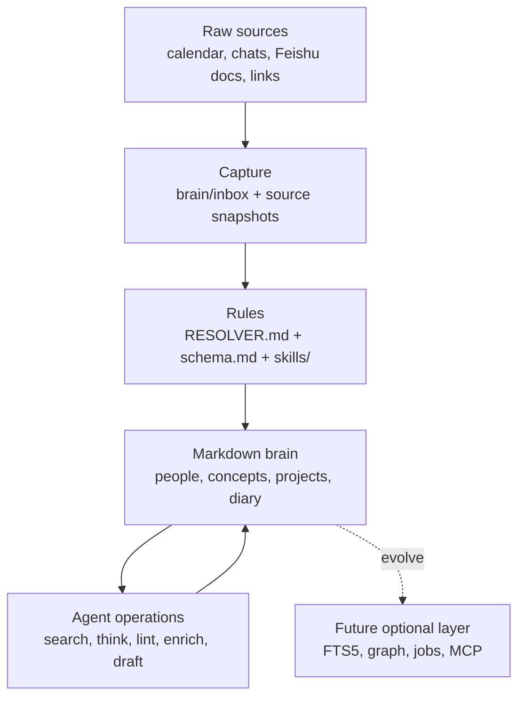

# Architecture

Second Brain is intentionally small at the storage layer and disciplined at the workflow layer.

## Design Principles

1. **File-system first**: Markdown files are the source of truth.
2. **Obsidian-friendly**: humans can browse backlinks and graph view without special infrastructure.
3. **Agent-maintained**: agents follow resolver, schema, and skill contracts before writing.
4. **Evidence-first**: raw sources stay preserved; summaries cite sources.
5. **Search then think**: retrieval and synthesis are separate operations.

## Layers



## Page Model

```text
frontmatter

# Title

Compiled Truth
- current state
- assessment
- open threads
- links

---

Timeline
- append-only evidence
- dated source entries
```

This avoids mixing what the brain currently believes with the evidence trail that produced it.

## Why Not Start With a Database?

The MVP optimizes for inspectability and contribution speed. A database layer becomes useful once there are enough pages to require:

- chunk indexing
- identity resolution
- typed edges
- background jobs
- remote MCP access
- multi-user permissions

Until then, Markdown plus scripts is the most debuggable version of the system.
