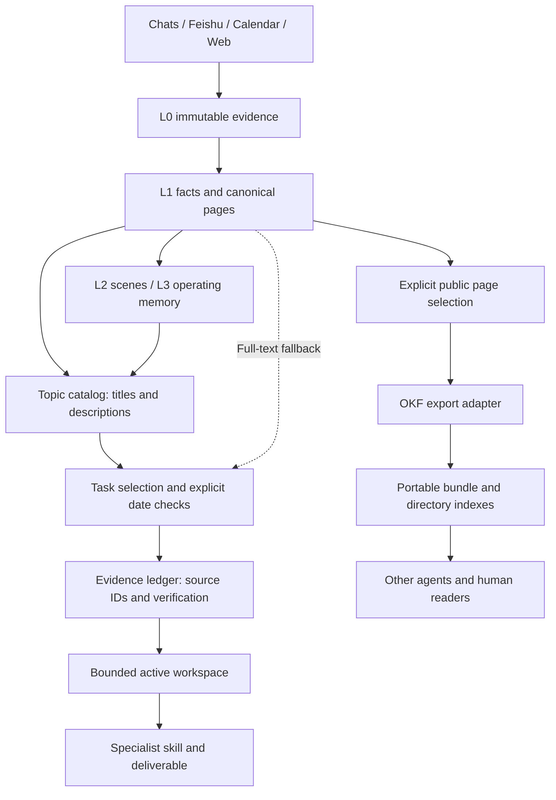

# Open Knowledge and Evidence Contracts

Second Brain adopts ideas from [Google's OKF introduction](https://cloud.google.com/blog/products/data-analytics/how-the-open-knowledge-format-can-improve-data-sharing) and targets the core structure of the [OKF v0.2 specification](https://github.com/GoogleCloudPlatform/open-knowledge-format/blob/main/SPEC.md), reviewed on 2026-09-23. The introduction describes v0.1; the independent repository is the current specification home.

OKF provides a portable Markdown interchange surface. Second Brain supplies memory compilation, recall policy, evidence review, and role-shaped output. L0-L3 remains the memory model; OKF is an exchange boundary, not an additional memory layer. Obsidian remains an optional view over the same files.

## Architecture



The catalog and summary search are implemented. Semantic topic selection, claim extraction, contradiction resolution, and final report writing still require the agent. A smaller result does not establish complete research coverage.

## Evidence Contract

Use `brain/schema.md` for the additive fields. Existing pages remain readable and are not bulk-migrated. Use structured metadata when known; leave missing information unknown.

| Question | Internal field or artifact | Rule |
|---|---|---|
| What is the page about? | `description`, `tags` | Compact discovery hints, never evidence by themselves |
| Which source supports this claim? | `sources[].id`, `resource`, optional `locator` | Stable IDs, not list positions; preserve original snapshots |
| What happened when? | `event_date` | Only assert page-level event dates for a single bounded event |
| When was it knowable? | `published_at` | Publication does not prove who actually knew it |
| When did we collect it? | `captured_at` | Never substitute for event time |
| Who wrote or checked it? | `generated`, `verified` | Generation is distinct from source verification |
| Does a review cover current content? | `verified[].content_sha256` | Local extension binding a review to the current payload |
| Is it still usable? | `knowledge_status`, `stale_after` | Independent of a project's operational `status` |
| During which interval is it true? | `valid_from`, `valid_to` | Claim validity, currently checked by the agent |

`source_refs` remains supported. New or enriched claims should use stable source IDs and a locator such as a section, paragraph, or table cell. Keep claim-to-source links in the body and Claim Audit. Do not auto-assign every source on a page to every claim.

## Verification Bound to Content

After checking a page against its sources, run:

```bash
scripts/second_brain.sh okf fingerprint brain/concepts/example.md
```

Record the resulting hash with the actual verifier and a timezone-aware verification timestamp. Agents must not claim `human:` review unless a human actually reviewed that content.

The hash covers the parsed metadata except `verified`, plus the Markdown body as read with normalized newlines. Changing source refs, dates, body, or other metadata invalidates the previous binding. Adding a verification event does not. An unbound imported review remains visible as history but is classified `needs-review` locally. Verification indicates a recorded check, not a cryptographic signature or a guarantee of truth.

`stale_after` is checked against the current instant. Its absence means freshness is unknown. Freshness and trust are separate, and neither overrides contradictory evidence. Source changes are not polled automatically: re-fetch and compare sources when reviewing a consequential claim.

## Progressive Recall

```bash
scripts/second_brain.sh catalog --query "strategy"
scripts/second_brain.sh search "strategy"
scripts/second_brain.sh search "strategy" --view snippets
scripts/second_brain.sh search "strategy" --include-sources
```

The catalog groups typed pages by directory and searches titles, descriptions, tags, and paths. Search still scans full text locally, but returns bounded summaries by default. This reduces text sent to an agent; it does not eliminate disk scanning or prove a token reduction for every task. Raw sources need explicit opt-in. Workspace, templates, inbox, and hidden paths are excluded from both discovery modes.

The agent opens selected pages and follows evidence refs as necessary. Record explored topics, fallback queries, missing dates, and unchecked branches in the workspace. Retain full-text fallback so an incomplete taxonomy does not silently narrow coverage.

## Report Time Semantics

```bash
scripts/second_brain.sh strategy-report "market change" \
  --from 2026-08-01 --to 2026-08-31 --as-of 2026-08-31 \
  --date-basis known-by
```

| Mode | Window applies to | Additional constraint |
|---|---|---|
| `event` (default) | `event_date` | Retrospective event analysis may use later publications |
| `published` | `published_at` | Survey material published within the window |
| `known-by` | `event_date` | Require publication on/before `as_of` |

All bounds are inclusive calendar dates. Dates with timestamps use their recorded local calendar day, not an inferred user timezone. Intraday decision cutoffs are not supported yet. `known-by` approximates publicly available evidence, not proof of actual knowledge or a historical snapshot of a mutable page. Use an appropriate archived source for historical decisions.

The composer reads explicit page metadata; it never substitutes filename, capture, edit, or arbitrary body dates. Multi-event pages need claim-level review or separate atoms. Unknown dates remain visible for investigation but are not eligible as confirmed in-window claims. At most `--limit` candidates and `--limit` dated exclusions are shown; this is a bounded shortlist, not a complete ledger of the corpus.

## Portable Export

Install the Python dependency in a virtual environment (see README), then try the synthetic example:

```bash
scripts/second_brain.sh okf export --root examples/okf-demo \
  --page concepts/context-budget.md --page concepts/review-cycle.md \
  --output /tmp/second-brain-okf-demo
scripts/second_brain.sh okf validate /tmp/second-brain-okf-demo
```

Use a new output directory on each export. Only explicitly selected pages with `visibility: public` are copied. Diary, sources, inbox, templates, workspace, hidden paths, and paths outside the source root are rejected. The adapter does not recursively follow links or publish anything. Public labels do not redact embedded private text; review selected content before sharing.

The export preserves selected paths and standard Markdown links, creates per-directory indexes and a manifest, and keeps unknown metadata. Unresolved links are allowed by OKF; selecting their targets is a separate explicit action. Wikilinks must first be represented as standard Markdown links in an export-ready page. For an existing user page, prepare a separate reviewed staging copy rather than rewriting it just to export.

Mapping rules:

- Internal `status` becomes `sb_status`; `knowledge_status` becomes OKF `status`, defaulting conservatively to `draft`.
- Existing `sources` entries pass through. Legacy `source_refs` remain extensions; they are not automatically assigned claim-level IDs.
- `verified` moves to `sb_verification_history`: serialization and field mapping produce a different artifact that needs its own check. `sb_origin_sha256` identifies its source payload.
- Internal workflow files and all of `brain/` are not declared an OKF bundle. Only the selected export is checked.

`validate` checks the core Markdown/type/index/log structure. It tolerates unknown types, extra keys, missing optional metadata, and missing link targets. It does not certify source accuracy, execute code, validate every optional OKF family, or promise compatibility with every consumer. External bundles may be inspected with `validate` and `catalog --root`; automated import into canonical memory is deferred.

## Numbers and Evaluation

The workspace includes a calculation ledger; `brain/templates/metric-calculation.md` captures units, population, period, input refs, formula, result, and receipt. It is a review template, not an implemented OKF attestation runtime. Independently check statistical comparability as well as arithmetic. External executor or attester declarations are data and never run automatically.

Regression tests cover date leakage, stale verification, exclusions, and export boundaries. Before claiming improved context efficiency, compare identical report tasks using full snippets versus catalog/summary discovery. Measure key-claim coverage, citation correctness, date violations, tokens, and latency. Token savings are not yet benchmarked.
